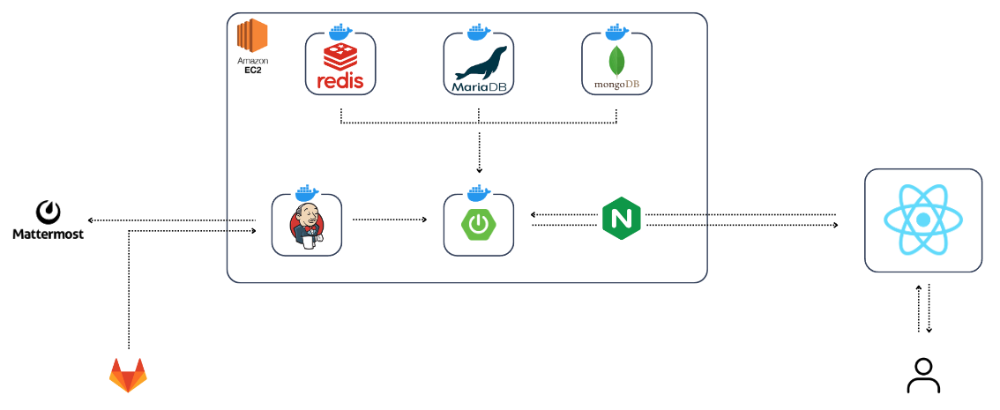
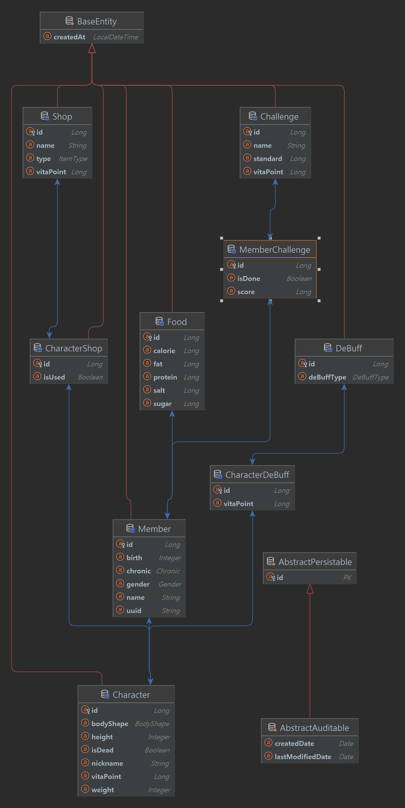

  

 

## 개요

프로젝트명: 비타(Vita)

프로젝트 기간(7주): 2024.04.08 ~ 2024.05.24

팀원(4명): 윤설(Infra, Backend), 엄세현(Front), 박철준(Front), 김성수(Front)

## 소개

비타는 사용자들이 건강을 체계적으로 관리하고, 개인의 라이프스타일에 맞춘 건강 분석 및 개선 계획을 제공하는 종합 건강 관리 플랫폼입니다. 이를 통해 사용자는 일상 속에서 건강한 생활 습관을 형성하고, 자기 건강 상태를 지속적으로 모니터링할 수 있습니다.

사용자가 그날 먹은 음식 사진을 입력받아 영양분을 분석하고 이를 기반으로 식습관을 평가합니다. 뿐만 아니라, 사용자의 흡연 및 음주와 같은 나쁜 습관에 대한 일일 검진을 통해 AI를 이용한 정교한 건강 분석을 제공합니다. 또한, 게임 및 일일 챌린지를 통해 사용자가 건강 관련 행동을 실천하도록 동기부여하며, 개인별 리포트를 통해 자가 분석을 도와줍니다. 이러한 기능들은 사용자가 건강한 생활 습관을 형성하고 유지하는 데 큰 도움을 줍니다.

## 배경

- 건강 관리에 대한 경각심이 부족한 현대 사람들
- 건강 관리에 대한 동기 부여 및 간단한 개인 진단 서비스의 부재

## 목표

- 사용자의 신체 정보를 기반으로 한 건강 관련 정보 제공
- 사용자 자가진단 기능 제공
- 사용자 맞춤형 AI 의사를 통한 조언
- 건강 관련 활동을 위한 다양한 동기 부여 제공

## 주요 기능

- **식단 분석**: 사용자가 찍은 사진의 영양분 분석
- **건강검진**: 사용자의 습관 검사를 통한 자가검진
- **구글 피트니스 연동**: 실제 사용자 데이터 연동
- **게임**: 사용자의 신체 정보를 토대로 한 캐릭터로 게임 제공
- **리포트**: 활동 분석 및 건강 관리 조언
- **일일 챌린지**: 일일 챌린지를 통한 사용자 건강 습관 장려

## 기대 효과

- 사용자의 건강 경각심 강화
- 나쁜 습관의 감소
- 좋은 습관에 대한 동기 부여

## 시스템 구성도

  

## 환경 상세

### IDE

- IntelliJ UE 2023.3.2
- Visual Studio Code

### Server

- Jenkins 2.441
- Docker 25.0.2
- MySQL 8.0
- mongoDB 7.0.7
- Redis 6.2.6

### Backend

- JVM 17
- Spring Boot 3.2.1
- Spring Security 6.2.2
- JPA 6.4.1.Final
- queryDSL 5.0.0
- Junit 5.0.0

### Frontend

- Axios 1.6.8
- Next 14.2.2
- Next-pwa 5.6.0
- React 18
- React-dom 18
- Sass 1.75.0
- Sharp 0.33.3
- Zustand 4.5.2

## 데이터베이스 ERD

  

## 📢 Site Layout

- 로그인 화면

- 회원가입 화면

- 캐릭터 생성 화면

- 메인화면

  

- 병원 화면

- 리포트 화면

- 게임 화면

- 디버프 화면

- 옵션 화면

 

## 🙋‍♂️ Distributed Roles

### BACKEND

#### 윤 설

### FRONTEND

#### 엄세현

- 프론트엔드 리더
- 초기 개발 환경 구축
- 디자인
  - 전체 캐릭터
  - 배경화면
  - 아이콘 및 로고
  - UI
  - 메인 페이지
  - 게임 페이지
  - 상점 페이지
  - 옵션 및 모달
  - 애니메이션
- 페이지 제작
  - 메인
  - 게임
  - 상점
  - 옵션
- Aixos 전역화
- 이미지 및 아이콘 동적 전역화

#### 박철준

- 프론트엔드 멤버
- 모임 담당

#### 김성수

- 프론트엔드 멤버

 

 

## ⚙️ Function

### 회원

💡 JWT를 이용한 로그인 구현

- [x] 구글 로그인
- [x] 로그인
- [x] 로그아웃
- [x] 회원 개인 정보 저장

### 메인

💡 사용자 정보를 기반으로 한 다마고치, 사용자 정보 및 각종 메뉴 페이지 구현

- [x] 메인 페이지
- [x] 캐릭터 수명 정보
- [x] 옵션
- [x] 일일 챌린지
- [x] 디버프
- [x] 다마고치 정보
- [x] 상점
- [x] 리포트
- [x] 병원
- [x] 게임

### 병원

💡 식사 분석, 일일 건강 검진을 통한 사용자 개인 건강 정보 분석 기능 구현

- [x] 식사 분석
- [x] 일일 건강 검진

### 리포트

💡 사용자의 활동 기록 열람 기능 구현

- [x] 사용자 활동 기록 조회
- [x] 전체 캐릭터 히스토리 조회

### 게임

💡 사용자끼리 경쟁이 가능한 게임 기능 구현

- [x] 랭킹 페이지
- [x] 달리기 게임
- [x] 헬스 게임

### 일일 챌린지

💡 사용자에게 건강한 활동 동기부여를 위한 챌린지 기능 구현

- [x] 미션 목록 리스트
- [x] 미션 달성 및 보상 수령

 
